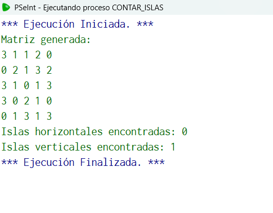

## Código en PSeInt

```pseudocode
Algoritmo contar_islas
	//Tienes una matriz de 5×5 de enteros generados aleatoriamente entre 0 y 3.
	//Cuenta cuántas veces aparece un patrón de tres números iguales seguidos: Horizontal, Vertical
  //entrada matriz3x3 con datos al azar
  //salida "islas verticales"/ "islas horizontales"
	Definir i, j, M Como Entero;
	Definir horizontal, vertical Como Entero;
	//Inicialización
	horizontal = 0;
	vertical = 0;
	Dimension M[5,5];
	// Llenar matriz con valores entre 0 y 3
	para i = 0 hasta 4
		para j = 0 hasta 4
			M[i,j] = azar(4);   // genera 0,1,2,3
		finpara
	finpara
	Escribir "Matriz generada:";
	para i = 0 hasta 4
		para j = 0 hasta 4
			Escribir Sin Saltar M[i,j], " ";
		finpara
		Escribir "";
	finpara
	// Buscar horizontales
	para i = 0 hasta 4
		para j = 0 hasta 2
			si M[i,j] = M[i,j+1] y M[i,j] = M[i,j+2] Entonces
				horizontal = horizontal + 1;
			FinSi
		finpara
	finpara
	// Buscar verticales
	para i = 0 hasta 2
		para j = 0 hasta 4
			si M[i,j] = M[i+1,j] y M[i,j] = M[i+2,j] Entonces
				vertical = vertical + 1;
			FinSi
		finpara
	finpara
	
	Escribir "Islas horizontales encontradas: ", horizontal;
	Escribir "Islas verticales encontradas: ", vertical;
FinAlgoritmo
```

