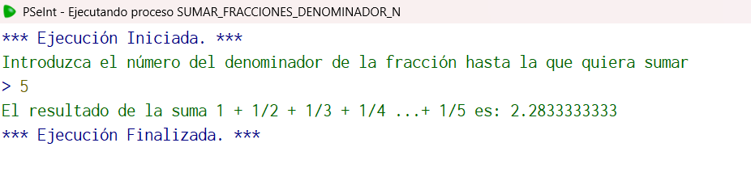

## Código en PSeInt

```pseudocode
Algoritmo sumar_fracciones_denominador_n
	//Elaborar un algoritmo que calcule e imprima la suma 1 + 1/2 + 1/3 + 1/4 ...+ 1/N.
	//Entrada i, n;
	//Salida Rsuma;
	//Caso de prueba: i=1, n=4
	//Salida: Rsuma=  25/12 o 2.08333...
	//Definir variables
	Definir i, n como enteros;
	Definir Rsuma como real;
	//Inicialización
	i<-0.0;
	n<-0.0;
	Rsuma<-0.0;
	//Solicitar datos
	Escribir "Introduzca el número del denominador de la fracción hasta la que quiera sumar";
	Leer n;
	//Creamos el ciclo
	Para i<-1 hasta n Hacer
		Rsuma= Rsuma+(1/i);
	FinPara
	//Escribimos el resultado;
	Escribir "El resultado de la suma 1 + 1/2 + 1/3 + 1/4 ...+ 1/N es: ", Rsuma;
FinAlgoritmo
  //Seleccione este porque es uno de los algoritmos que tengo mejor explicados, y lo realice de una buena forma
```

