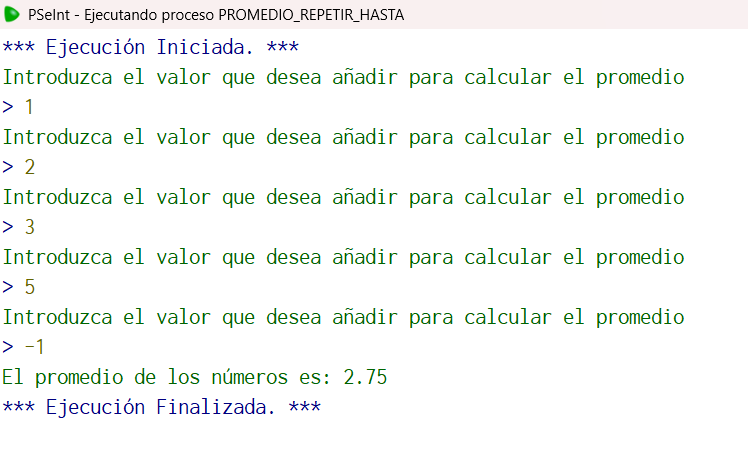

## Código en PSeInt

```pseudocode
Algoritmo promedio_repetir_hasta
	//Elabore un algoritmo que lea varios números hasta que el usuario introduzca -1 y que determine e
	//imprima el promedio de los números. Usa ciclo Repetir.
	//Entrada: num
	//Salida: prom
	//Caso de prueba num=1, num=2, num=3, num=5, num-1, ciclos=4
	//Salida prom=2.75
	//Definir variables
	Definir num, prom como real;
	Definir ciclos como entero;
	//Inicialización
	num<-0.0;
	prom<-0.0;
	ciclos<-0.0;
	//Ciclo Mientras
	Mientras num<>-1
		//Solicitamos datos
		Escribir "Introduzca el valor que desea añadir para calcular el promedio";
		Leer num;
		Si num<>-1 entonces //en caso de que el valor sea -1 que este no sea considerado en el promedio
			prom=(prom+num);
			ciclos=ciclos+1;
		FinSi
	FinMientras
	//Calculamos el promed
	prom<-prom/ciclos;
	Escribir "El promedio de los números es: ", prom;
FinAlgoritmo
  //Elegí este algoritmo porque fue el primero que me introdujo el termino de centinela
```

