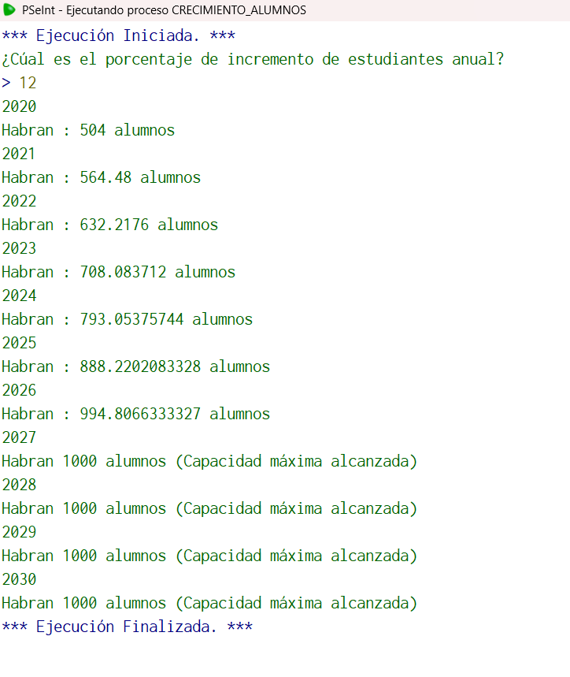

## Código en PSeInt

```pseudocode
Algoritmo crecimiento_alumnos
	// La carrera de Ciencias de la Computación, tiene actualmente 450 alumnos. Se espera tener un
	//crecimiento anual del X% en el número de alumnos cada año con respecto al año anterior. Elaborar
	//un algoritmo que calcule e imprima la población estudiantil que se espera tener en todos los años
	//desde 2020 a 2030. El usuario proporciona el valor de X. Como la capacidad máxima de la FMAT es
	//limitada a 1000 alumnos cuando se alcance el límite, ya no crece más.
	//Entrada: X
	//Salida: alumnos
	//Caso de prueba: X=10
	//Salida= 495, 544.5, 598.95, 658.84, 724.729,  797.2024,  876.92269, 964.614964, 1000, 1000, 1000
	//Definir variables
	Definir i, n como enteros;
	Definir X, alumnos como real;
	//Inicialización
	i<-0.0;
	n<-2030;
	X<-0.0;
	alumnos<-450;
	//Solicitamos datos
	Escribir "¿Cúal es el porcentaje de incremento de estudiantes anual?";
	Leer X;
	//sacamos el porcentaje
	X<-X/100;
	//Ciclo
	Para i<-2020 hasta n Hacer
		Escribir i;
		//Aumentamos alumnos segun el porcentaje
		alumnos<-alumnos*(1+X);
		//Limitamos la capacidad a 1000 alumnos
		Si alumnos>=1000
			Escribir "Habran 1000 alumnos (Capacidad máxima alcanzada)";
		sino
			Escribir "Habran : ", alumnos, " alumnos";
		FinSi
	FinPara
FinAlgoritmo
  //Elegí este algoritmo porque recuerdo que en su momento este crecia de forma desproporcionada y se me hizo muy complejo resolverlo para lo que conocía
```

