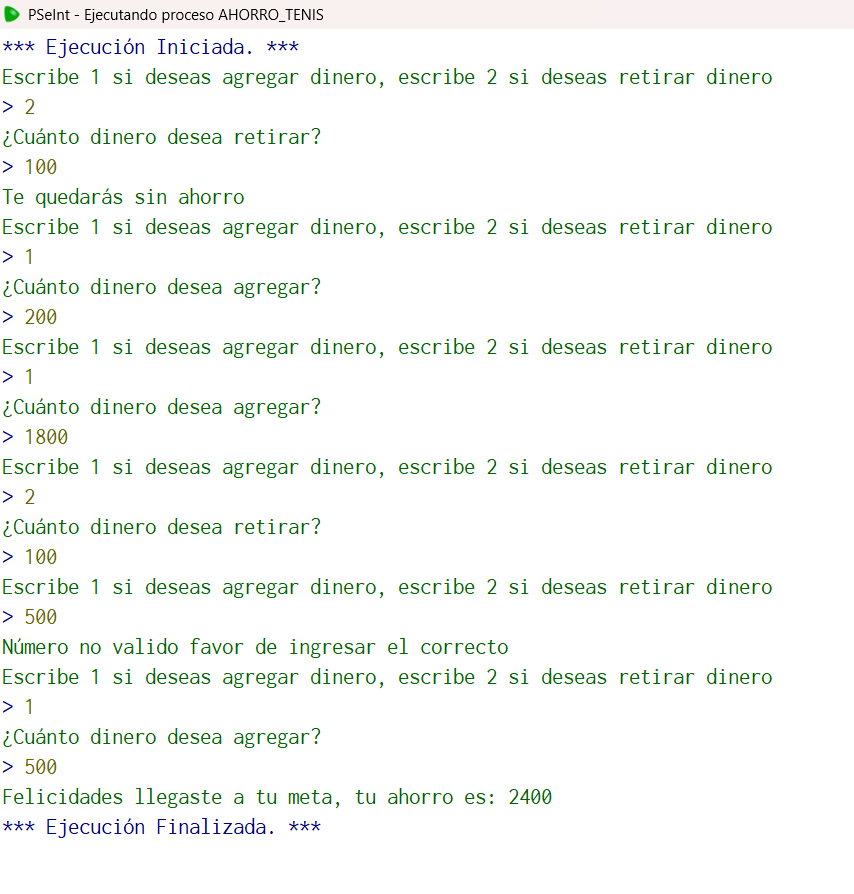

## Código en PSeInt

```pseudocode
Algoritmo ahorro_tenis
	//Una persona ahorra diferentes cantidades de dinero en una cuenta porque quiere comprarse unos
	//tenis que cuestan 2100 pesos. Sin embargo, a veces, se permite retirar un poco de su ahorro. Escriba
	//un algoritmo que permita ingresar la cantidad que ahorra o la cantidad que retira, si llega a su meta
	//que lo felicite y si intenta retirar más de lo que tiene que le diga "Te quedarás sin ahorro".
	//Entrada: cantidad
	//salida: ahorro/ "Felicidades llegaste a tu meta" o "Te quedarás sin ahorro"
	//Caso de prueba: cantidad=2000, cantidad=-300, cantidad=400
	//salida: "Felicidades llegaste a tu meta"
	//Definir variables
	Definir cantidad, ahorro como real;
	Definir accion como entero;
	//Inicializamos
	cantidad<-0.0;
	ahorro<-0.0;
	accion<-0.0;
	//Ciclo
	Repetir
		Escribir "Escribe 1 si deseas agregar dinero, escribe 2 si deseas retirar dinero";
		Leer accion;
		Segun accion Hacer
			1:
				Escribir "¿Cuánto dinero desea agregar?";
				Leer cantidad;
				ahorro=ahorro+cantidad;
			2:
				Escribir "¿Cuánto dinero desea retirar?";
				Leer cantidad;
				Si cantidad>=ahorro Entonces
					Escribir "Te quedarás sin ahorro";
				SiNo
					ahorro=ahorro+(cantidad*(-1));
				FinSi
			De Otro Modo:
				Escribir "Número no valido favor de ingresar el correcto";
		Fin Segun
	Hasta Que ahorro=2100
	Escribir "Felicidades llegaste a tu meta, tu ahorro es: ", ahorro;
FinAlgoritmo
  //Elegí este algoritmo porque fue la primera vez que recuerdo que utilicé un menú por mi cuenta
```

