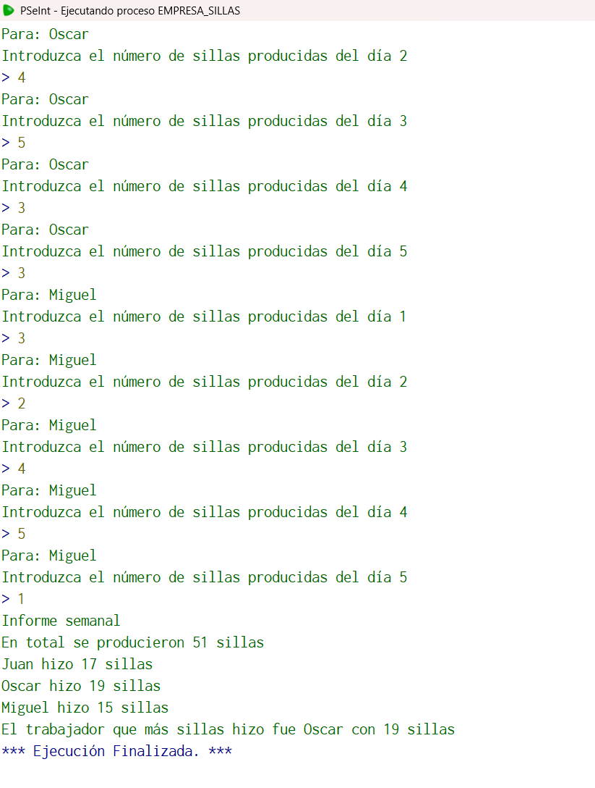

## Código en PSeInt

```pseudocode
Algoritmo empresa_sillas
	//En una empresa manufacturera de sillas, se tienen 3 trabajadores, y cada trabajador produce un
	//número de sillas al día. Escriba un algoritmo que permita capturar el nombre de cada trabajador y el
	//número de sillas que produce cada día de la semana (L-V). Al final el algoritmo debe imprimir el
	//nombre de cada trabajador y el total de sillas realizadas por dicho trabajador en la semana, al final se
	//deberá imprimir el total de sillas hechas por todos los trabajadores y el trabajador que produjo más sillas esa semana.
	//Entrada: nombre1, nombre2,  nombre3, sillas, Totalsillas, TPsillas
	//Salida: (nombre del que más sillas produjo), Totalsillas
	//Caso de prueba: nombre1= Juan TPsillas=10 , nombre2=Pedro TPsillas=20, nombre3=Oscar TPsillas=21
	//Salida "El trabajador que más sillas hizo fue "Oscar" con 21 sillas y se producieron 51 sillas"
	//Definir variables
	Definir nombre1, nombre2, nombre3 como caracter;
	Definir sillas, Totalsillas, TP1sillas, TP2sillas, TP3sillas, i, n como entero;
	//Inicialización
	nombre1<-"nulo";
	nombre2<-"nulo";
	nombre3<-"nulo";
	sillas<-0.0;
	Totalsillas<-0.0;
	TP1sillas<-0.0;
	TP2sillas<-0.0;
	TP3sillas<-0.0;
	i<-0.0;
	n<-5;
	//Solicitamos datos
	Escribir "Introduzca el nombre del primer empleado";
	Leer nombre1;
	Escribir "Introduzca el nombre del segundo empleado";
	Leer nombre2;
	Escribir"Introduzca el nombre del tercer empleado";
	Leer nombre3;
	Para i<-1 hasta n Hacer
		Escribir "Para: " nombre1;
		Escribir "Introduzca el número de sillas producidas del día ", i;
		Leer sillas;
		TP1sillas<-TP1sillas+sillas;
	FinPara
	Para i<-1 hasta n Hacer
		Escribir "Para: " nombre2;
		Escribir "Introduzca el número de sillas producidas del día ", i;
		Leer sillas;
		TP2sillas<-TP2sillas+sillas;
	FinPara
	Para i<-1 hasta n Hacer
		Escribir "Para: " nombre3;
		Escribir "Introduzca el número de sillas producidas del día ", i;
		Leer sillas;
		TP3sillas<-TP3sillas+sillas;
	FinPara
	Totalsillas<-TP1sillas+TP2sillas+TP3sillas;
	//Imprimimos el informe general
	Escribir "Informe semanal";
	Escribir "En total se producieron ", Totalsillas," sillas";
	Escribir nombre1, " hizo ", TP1sillas, " sillas";
	Escribir nombre2, " hizo ", TP2sillas, " sillas";
	Escribir nombre3, " hizo ", TP3sillas, " sillas";
	//Buscamos quien fue el que más sillas hizo en la semana
	si TP1sillas==TP2sillas y TP2sillas==TP3sillas entonces
		Escribir "El trabajador que hizo más sillas fue: Hubo triple empate entre ", nombre1, " ,", nombre2, " y ", nombre3, " con ", TP2sillas, " sillas";
	SiNo
		si TP1sillas==TP2sillas y TP1sillas>TP3sillas entonces
			Escribir "El trabajador que hizo más sillas fue: Hubo un empate los trabajadores que más sillas hicieron fueron ", nombre1, " y ", nombre2, " con ", TP2sillas," sillas";
		SiNo
			Si TP2sillas==TP3sillas y TP2sillas>TP1sillas entonces
				Escribir "El trabajador que hizo más sillas fue: Hubo un empate los trabajadores que más sillas hicieron fueron ", nombre2, " y ", nombre3, " con ", TP2sillas," sillas";
			SiNo
				Si TP1sillas>TP2sillas y TP1sillas>TP3sillas Entonces
					Escribir "El trabajador que más sillas hizo fue ", nombre1," con ", TP1sillas," sillas";
				SiNo
					Si TP2sillas>TP3sillas entonces
						Escribir "El trabajador que más sillas hizo fue ", nombre2," con ", TP2sillas," sillas";
					SiNo
						Escribir "El trabajador que más sillas hizo fue ",nombre3," con ", TP3sillas," sillas";
					Finsi	
				FinSi
			Finsi	
		Finsi		
	Finsi
FinAlgoritmo
 //Elegí este algoritmo porque fue super laborioso y quizás la dificultad no fue exagerada, pero requeria demasiadas cosas haciendo que el código creciera demasiado
 //Sobre todo en el apartado de comparaciones para buscar a un ganador
```

