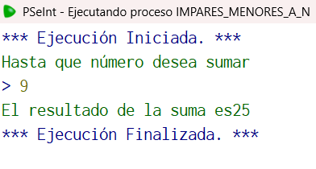

## Código en PSeInt

```pseudocode
Algoritmo impares_menores_a_n
	//Caso de prueba: n=7
	//Rsum=16
	Definir num, Rsum como entero;
	num<-0;
	Rsum<-0;
	Escribir "Hasta que número desea sumar";
	Leer num;
	Si num es par entonces
		num<-num-1;
	FinSi
	Repetir
		Rsum<-Rsum+num;
		num<-num-2;
	Hasta Que num==-1;
	Escribir "El resultado de la suma es", Rsum;
FinAlgoritmo
  //Elegí este algoritmo porque pese a ser muy similar al primero, realmente le añade la dificultad de que  no puede mantener un paso constante si no que debe verificarse antes si es par o impar
```

