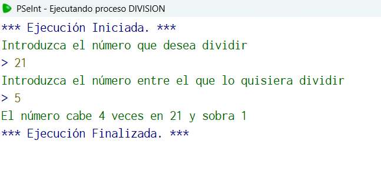

## Código en PSeInt

```pseudocode
Algoritmo division
	//Algoritmo que realice una división sin utilizar la división como tal sino que utiliza ciclos para ir reduciendo el valor
	//entrada N, M
	//salida El numero cabe "tantas veces" en "M" y sobra "N";
	//Caso de prueba: N=21, M=5
	//Salida: "5 cabe 4 veces en 21 y sobra 1"
	Definir N, M, contador, numOriginal como entero;
	N<-0;
	M<-0;
	contador<-0;
	numOriginal<-0;
	Escribir "Introduzca el número que desea dividir";
	Leer N;
	Escribir "Introduzca el número entre el que lo quisiera dividir";
	Leer M;
	numOriginal<-N;
	Mientras N<M
		Escribir "El primer número debe ser mayor o igual al segundo no puede ser menor favor de introducir otro";
		Leer M;
	FinMientras
	Mientras N>=M
		N<-N-M;
		contador<-contador+1;
	FinMientras
	Escribir "El número cabe ", contador, " veces en ", numOriginal, " y sobra ", N;
FinAlgoritmo
  //Elegí este algoritmo porque se me hizo muy interesante el como se puede realizar una división sin utilizarla explicitamente 
```

