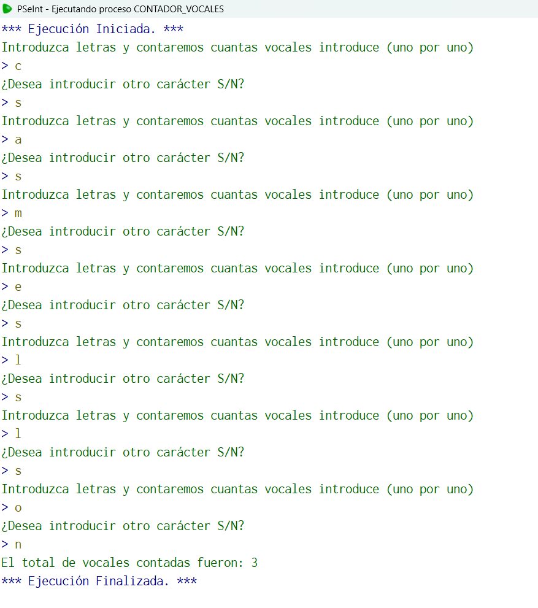

## Código en PSeInt

```pseudocode
Algoritmo contador_vocales
	//Dadas ciertas letras se contarán las vocales
	//entrada letra
	//salida vocales 
	//caso de prueba: letra="a", centinela="s" letra="b", centinela="s", letra="o", centinela="N"
	//vocales=2
	Definir vocales como entero;
	Definir centinela, letra como caracter;
	vocales<-0;
	centinela<-"S";
	letra<-"nulo";
	Mientras centinela<>"N"
		Escribir "Introduzca letras y contaremos cuantas vocales introduce (uno por uno)";
		Leer letra;
		letra<-Mayusculas(letra);
		Si letra="A" o letra="E" o letra="I" o letra="O" o letra="U"
			vocales<-vocales+1;
		FinSi
		Escribir "¿Desea introducir otro carácter S/N?";
		Leer centinela;
		centinela<-Mayusculas(centinela);
	FinMientras
	Escribir "El total de vocales contadas fueron: ", vocales;
FinAlgoritmo
  //Elegí este algoritmo porque es el primer algoritmo que recuerdo donde utilizo la comparación con caracteres y a su vez utilizo un centinela
```

