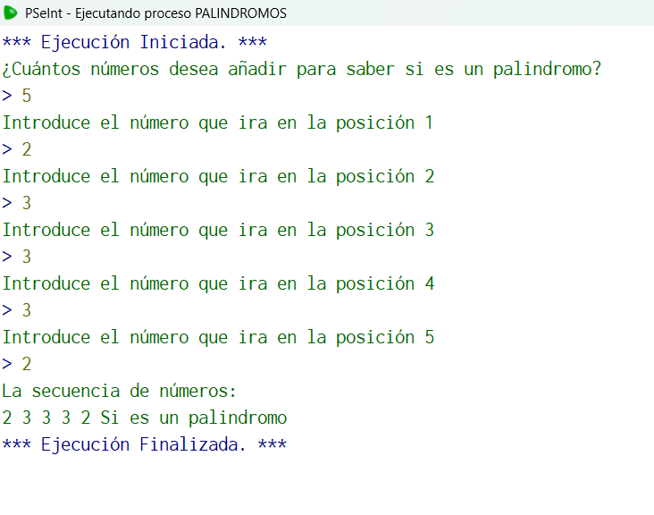

## Código en PSeInt

```pseudocode
Algoritmo palindromos
	// Un matemático desea verificar si una secuencia de números forma un palindromo, es decir, si se lee igual de izquierda 
	// a derecha que de derecha a izquierda.
	//Entrada: n
	//Salida: "Es palindromo", "No es palindromo"
	//Caso de prueba: n=4, arreglo( 1,2,2,1)
	//salida: "Es palindromo"
	//Definir variables
	Definir n, i, arreglo, orig como entero;
	Definir bandera como logico;
	//Inicialización
	bandera<-verdadero;
	n<-0;
	orig<-0;
	i<-0;
	//Solicitamos datos
	Escribir "¿Cuántos números desea añadir para saber si es un palindromo?";
	Leer n;
	//Validamos los datos
	Mientras n<=0
		Escribir "Recuerda que el valor de la cantidad de números a meter debe ser un entero mayor a 0";
		Escribir"Favor de introducir otro número";
		Leer n;
	FinMientras
	//guardamos el valor de n en una variable puesto que después puede perderse
	orig<-n;
	//Calculamos la cantidad de datos que tendrá el arreglo
	dimension arreglo[n];
	//Creamos un ciclo para que el usuario ingrese los valores
	para i<-0 hasta n-1 hacer
		Escribir "Introduce el número que ira en la posición ", i+1;
		Leer arreglo[i];
	FinPara
	//Determinar si un valor es palindromo
	i<-0;
	//le restamos 1 a n debido a que los arreglos inician en 0, por lo que la posición final siempre será menor
	n<-n-1;
	//Comparamos el primer con el último valor, el segundo con el penultimo y asi sucesivamente
	Mientras i<n
		Si arreglo[i]<>arreglo[n]
			bandera <-falso;
		FinSi
		i<-i+1;
		n<-n-1;
	FinMientras
	//Imprimos la secuencia de números introducida en el arreglo
	Escribir "La secuencia de números:";
	Para i<-0 hasta orig-1
		Escribir arreglo[i], " " sin saltar;
	FinPara
	//Con ayuda de una bandera determinamos si la bandera fue marcada como falsa si es o no palindromo
	Si bandera
		Escribir "Si es un palindromo" ;
	SiNo
		Escribir "No es un palindromo";
	FinSi
FinAlgoritmo
//Elegí ese algoritmo por su complejidad, y lo mucho que me enseño sobre ciclos y arreglos, cabe recalcar que fue para la tarea de vectores
```

